<style>
body {
    overflow: scroll;
}
</style>


<style>
.small-code pre code {
  font-size: 1em;
}
</style>


Ordinal predictors,   what to do? 
========================================================
author: Won Lee
date: November 10th, 2020
autosize: false
font-family: 'Helvetica'

Estimating Monotonic Effects with brms

Index
========================================================
- Ordinal variable
- why do we (have to) care about this?
- Monotonic effects
- Implementing mo() function in brms package in R
- Interpret the results 

All materials are located at [my github,](https://github.com/veritas1uxmea/mo_brms_function_stats_snack.git)
and the slides can be found on [my website.](https://wonlee-neuroscientist.com/04_bioinfo.html)


What is ordinal factor 
========================================================

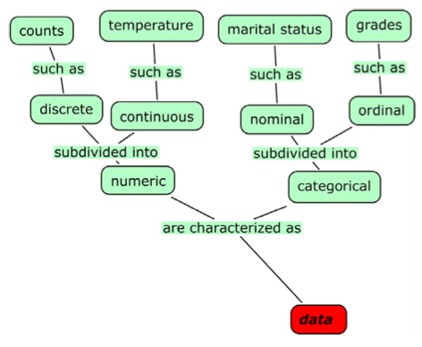

What is ordinal factor 
========================================================
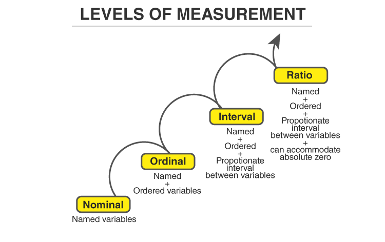


Sometimes the data you get is all you've got
========================================================
- Likert scale items 

<small>Strongly Disagree, Disagree, Neutral, Agree, Strongly Agree</small>

- When they ask you your annual income

<small>Below 20K, 20-40K, 40-100K, greater than 100K</small>

- How many meals in a week do you eat cheese?

<small> 0-2 times, 3-5 times, 6-9 times, more than 10 times</small>


Why do we have to care about this ...?
========================================================
Whoever studied animal behavior, might have had the same question:
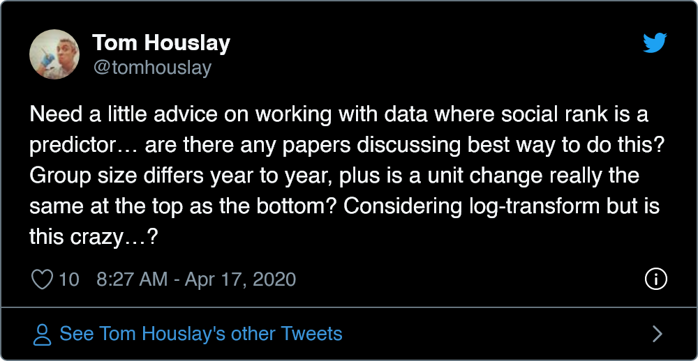

========================================================
so someone replied...:
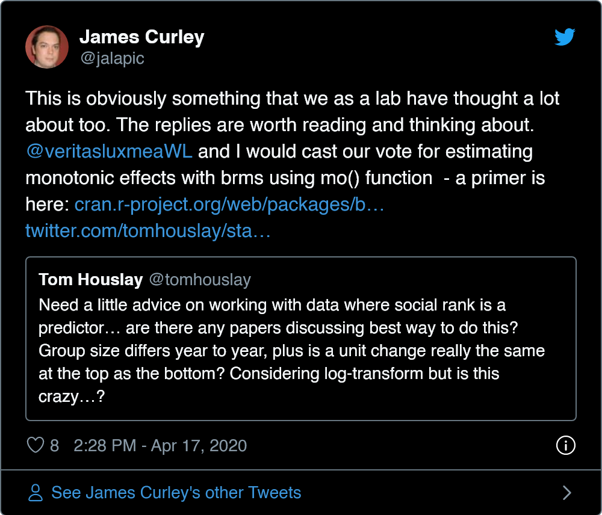


### We should not assume the "equidistance" when it comes to ordinal predictors
========================================================
Equidistance refers to intervals with values that are distributed in equal units. 

When we treat an ordinal predictor as numeric, the models will assume the 'equidistance' of the given variable

Know your data!! 


For example, 
========================================================
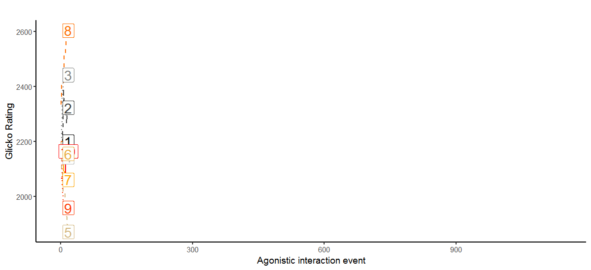


Modelling monotonic effects
========================================================
> In many practical settings, we do often expect the changes between adjacent categories to be monotonic, that is, consistently negative or positive across the full range of the ordinal variable 

> Burkner & Charpentier (2020)

========================================================
[Jimenez and Mesoudi (2020)](https://brill.com/view/journals/jocc/20/3-4/article-p238_4.xml)

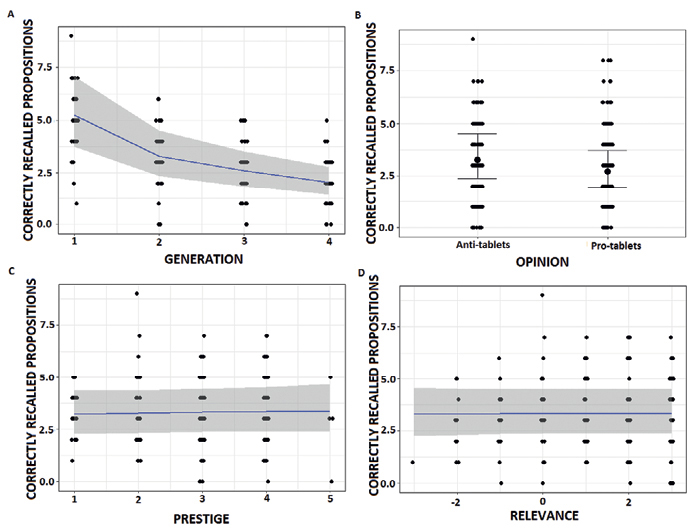

========================================================
[Jimenez and Mesoudi (2020)](https://brill.com/view/journals/jocc/20/3-4/article-p238_4.xml)
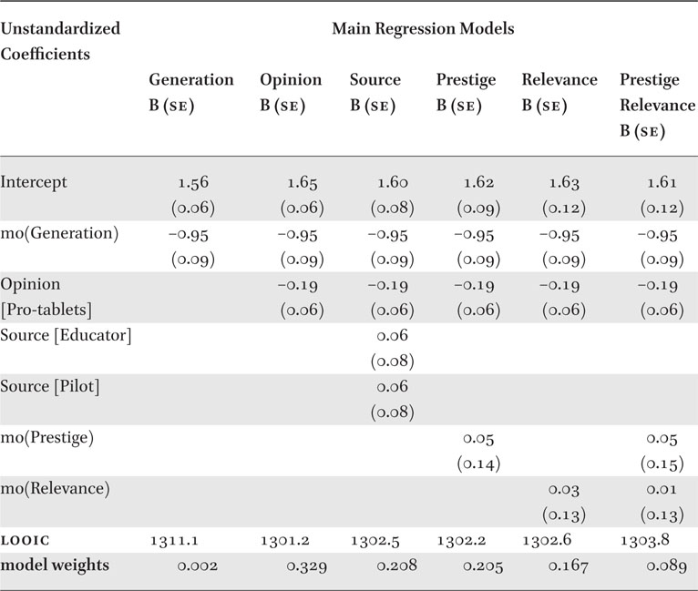

========================================================
[Williamson et al., (2019)](https://www.nature.com/articles/s41598-019-43747-w)
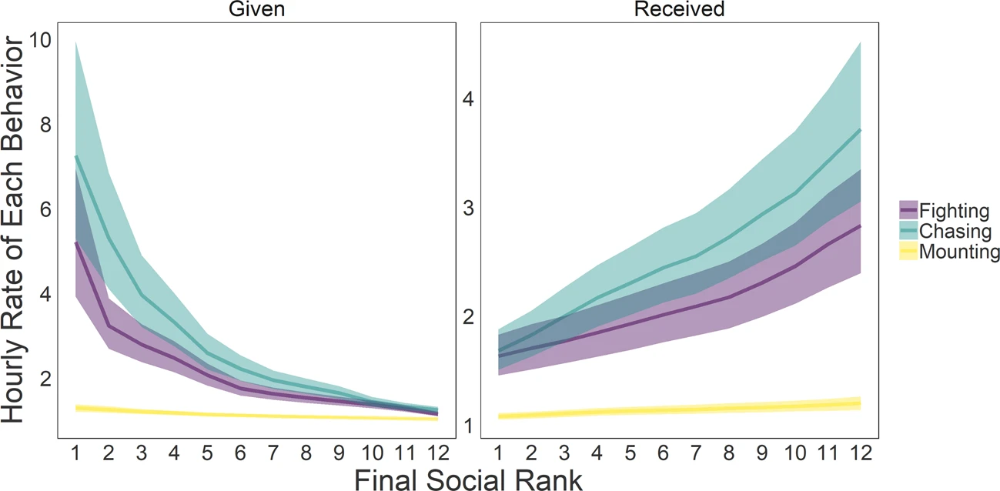


Let's try it out
========================================================
class: small-code
- Annual income: Likert scale itmes
- Life satisfaction: Scale from 0 to 100 

Full tutorial [here](https://cran.r-project.org/web/packages/brms/vignettes/brms_monotonic.html)

```r
income_options <- c("below_20", "20_to_40", "40_to_100", "greater_100")
income <- factor(sample(income_options, 100, TRUE), 
                  levels = income_options, ordered = TRUE)
mean_ls <- c(30, 60, 70, 75)
ls <- mean_ls[income] + rnorm(100, sd = 7)
dat <- data.frame(income, ls)
```

Plot it first!
========================================================


Monotonic model 
========================================================
class: small-code

```r
fit1 <- brm(ls ~ mo(income), 
            # mo() for monotonic effect
            data = dat,
            file = "fit1.RDS") 
# saves file so we don't have to run this model every time
```

Monotonic model 
========================================================
class: small-code

```r
summary(fit1)
```

```
 Family: gaussian 
  Links: mu = identity; sigma = identity 
Formula: ls ~ mo(income) 
   Data: dat (Number of observations: 100) 
Samples: 4 chains, each with iter = 2000; warmup = 1000; thin = 1;
         total post-warmup samples = 4000

Population-Level Effects: 
          Estimate Est.Error l-95% CI u-95% CI Rhat Bulk_ESS Tail_ESS
Intercept    30.84      1.68    27.54    34.20 1.00     2572     2274
moincome     14.61      0.75    13.14    16.08 1.00     2526     2221

Simplex Parameters: 
             Estimate Est.Error l-95% CI u-95% CI Rhat Bulk_ESS Tail_ESS
moincome1[1]     0.65      0.04     0.57     0.74 1.00     2765     2453
moincome1[2]     0.23      0.05     0.13     0.34 1.00     3581     2597
moincome1[3]     0.11      0.05     0.02     0.21 1.00     2494     1284

Family Specific Parameters: 
      Estimate Est.Error l-95% CI u-95% CI Rhat Bulk_ESS Tail_ESS
sigma     7.91      0.57     6.90     9.09 1.00     3102     2524

Samples were drawn using sampling(NUTS). For each parameter, Bulk_ESS
and Tail_ESS are effective sample size measures, and Rhat is the potential
scale reduction factor on split chains (at convergence, Rhat = 1).
```

Monotonic model 
========================================================
class: small-code

```r
plot(conditional_effects(fit1)) 
```

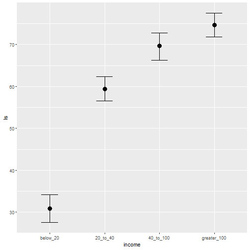

Treat income to be continuous
========================================================
class: small-code

```r
dat$income_num <- as.numeric(dat$income)
fit2 <- brm(ls ~ income_num, 
            data = dat,
            file = "fit2.RDS")
```

Treat income to be continuous
========================================================
class: small-code

```r
summary(fit2)
```

```
 Family: gaussian 
  Links: mu = identity; sigma = identity 
Formula: ls ~ income_num 
   Data: dat (Number of observations: 100) 
Samples: 4 chains, each with iter = 2000; warmup = 1000; thin = 1;
         total post-warmup samples = 4000

Population-Level Effects: 
           Estimate Est.Error l-95% CI u-95% CI Rhat Bulk_ESS Tail_ESS
Intercept     24.55      2.50    19.70    29.52 1.00     3926     2898
income_num    13.71      0.90    11.90    15.46 1.00     3933     3081

Family Specific Parameters: 
      Estimate Est.Error l-95% CI u-95% CI Rhat Bulk_ESS Tail_ESS
sigma    10.05      0.72     8.76    11.60 1.00     3548     2800

Samples were drawn using sampling(NUTS). For each parameter, Bulk_ESS
and Tail_ESS are effective sample size measures, and Rhat is the potential
scale reduction factor on split chains (at convergence, Rhat = 1).
```

Treat income to be continuous
========================================================
class: small-code

```r
plot(conditional_effects(fit2))
```

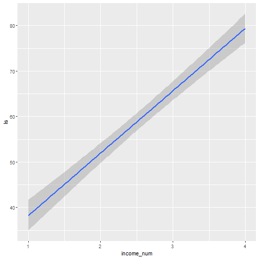

Treat income as an unordered factor
========================================================
class: small-code

```r
contrasts(dat$income) <- contr.treatment(4)
contrasts(dat$income)
```

```
            2 3 4
below_20    0 0 0
20_to_40    1 0 0
40_to_100   0 1 0
greater_100 0 0 1
```

```r
fit3 <- brm(ls ~ income, 
            data = dat,
            file = "fit3.RDS")
```

Treat income as an unordered factor
========================================================
class: small-code

```r
summary(fit3)
```

```
 Family: gaussian 
  Links: mu = identity; sigma = identity 
Formula: ls ~ income 
   Data: dat (Number of observations: 100) 
Samples: 4 chains, each with iter = 2000; warmup = 1000; thin = 1;
         total post-warmup samples = 4000

Population-Level Effects: 
          Estimate Est.Error l-95% CI u-95% CI Rhat Bulk_ESS Tail_ESS
Intercept    30.43      1.66    27.19    33.68 1.00     2984     2599
income2      29.07      2.28    24.56    33.52 1.00     3162     3065
income3      39.29      2.38    34.68    44.02 1.00     3189     3127
income4      44.32      2.25    40.01    48.74 1.00     3096     3038

Family Specific Parameters: 
      Estimate Est.Error l-95% CI u-95% CI Rhat Bulk_ESS Tail_ESS
sigma     7.89      0.58     6.86     9.11 1.00     4010     2779

Samples were drawn using sampling(NUTS). For each parameter, Bulk_ESS
and Tail_ESS are effective sample size measures, and Rhat is the potential
scale reduction factor on split chains (at convergence, Rhat = 1).
```

Treat income as an unordered factor
========================================================
class: small-code

```r
plot(conditional_effects(fit3))
```


Model comparison
========================================================
class: small-code
Leave-one-out cross validation (LOO)
- expected log posterior predictive density (ELPD) difference

```r
loo(fit1, fit2, fit3) -> loo_result
loo_result$diffs
```

```
     elpd_diff se_diff
fit1   0.0       0.0  
fit3  -0.1       0.3  
fit2 -23.3       5.8  
```

```r
loo_compare(loo(fit1), loo(fit2), loo(fit3))
```

```
     elpd_diff se_diff
fit1   0.0       0.0  
fit3  -0.1       0.3  
fit2 -23.3       5.8  
```

Okay, then how do I interpret the results?
========================================================
class: small-code

```r
summary(fit1)
```

```
 Family: gaussian 
  Links: mu = identity; sigma = identity 
Formula: ls ~ mo(income) 
   Data: dat (Number of observations: 100) 
Samples: 4 chains, each with iter = 2000; warmup = 1000; thin = 1;
         total post-warmup samples = 4000

Population-Level Effects: 
          Estimate Est.Error l-95% CI u-95% CI Rhat Bulk_ESS Tail_ESS
Intercept    30.84      1.68    27.54    34.20 1.00     2572     2274
moincome     14.61      0.75    13.14    16.08 1.00     2526     2221

Simplex Parameters: 
             Estimate Est.Error l-95% CI u-95% CI Rhat Bulk_ESS Tail_ESS
moincome1[1]     0.65      0.04     0.57     0.74 1.00     2765     2453
moincome1[2]     0.23      0.05     0.13     0.34 1.00     3581     2597
moincome1[3]     0.11      0.05     0.02     0.21 1.00     2494     1284

Family Specific Parameters: 
      Estimate Est.Error l-95% CI u-95% CI Rhat Bulk_ESS Tail_ESS
sigma     7.91      0.57     6.90     9.09 1.00     3102     2524

Samples were drawn using sampling(NUTS). For each parameter, Bulk_ESS
and Tail_ESS are effective sample size measures, and Rhat is the potential
scale reduction factor on split chains (at convergence, Rhat = 1).
```


Always be careful when building models
========================================================
### It all depends on what questions you are asking. 

### If you think it's possible you'll see a u-shaped effect, do not use monotonic effect model (or test both)


```r
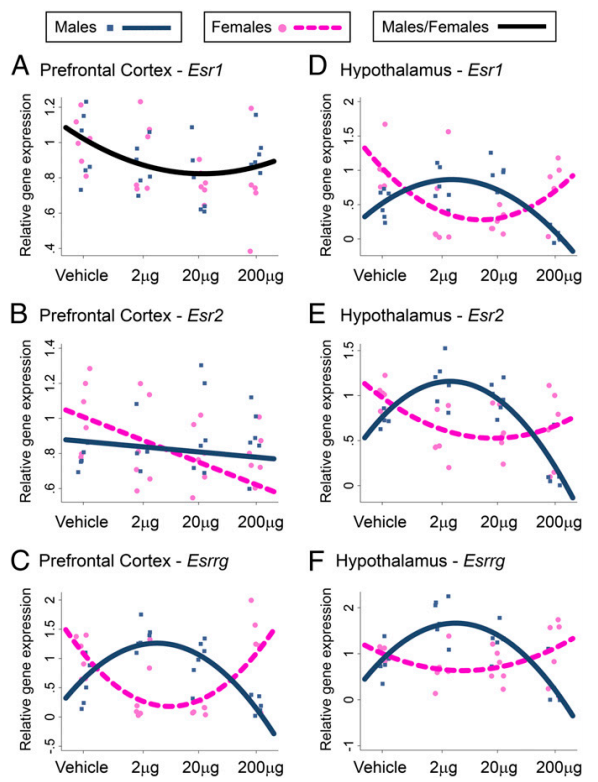
```


Thank you! Any questions?
========================================================
class: small-code
Resources:
https://xcelab.net/rm/statistical-rethinking/
https://bookdown.org/ajkurz/Statistical_Rethinking_recoded/


```r
sessionInfo()
```

```
R version 4.0.3 (2020-10-10)
Platform: x86_64-w64-mingw32/x64 (64-bit)
Running under: Windows 10 x64 (build 14393)

Matrix products: default

locale:
[1] LC_COLLATE=English_United States.1252 
[2] LC_CTYPE=English_United States.1252   
[3] LC_MONETARY=English_United States.1252
[4] LC_NUMERIC=C                          
[5] LC_TIME=English_United States.1252    

attached base packages:
[1] grid      stats     graphics  grDevices utils     datasets  methods  
[8] base     

other attached packages:
 [1] tweetrmd_0.0.8  brms_2.14.0     Rcpp_1.0.5      gifski_0.8.6   
 [5] gganimate_1.0.7 forcats_0.5.0   stringr_1.4.0   dplyr_1.0.2    
 [9] purrr_0.3.4     readr_1.4.0     tidyr_1.1.2     tibble_3.0.4   
[13] ggplot2_3.3.2   tidyverse_1.3.0 knitr_1.30     

loaded via a namespace (and not attached):
  [1] websocket_1.3.1      TH.data_1.0-10       colorspace_1.4-1    
  [4] ellipsis_0.3.1       ggridges_0.5.2       rsconnect_0.8.16    
  [7] estimability_1.3     markdown_1.1         base64enc_0.1-3     
 [10] fs_1.5.0             rstudioapi_0.11      farver_2.0.3        
 [13] rstan_2.21.2         DT_0.16              chromote_0.0.0.9002 
 [16] fansi_0.4.1          mvtnorm_1.1-1        lubridate_1.7.9     
 [19] xml2_1.3.2           splines_4.0.3        codetools_0.2-16    
 [22] bridgesampling_1.0-0 shinythemes_1.1.2    bayesplot_1.7.2     
 [25] jsonlite_1.7.1       broom_0.7.2          dbplyr_1.4.4        
 [28] png_0.1-7            shiny_1.5.0          compiler_4.0.3      
 [31] httr_1.4.2           emmeans_1.5.1        backports_1.1.10    
 [34] assertthat_0.2.1     Matrix_1.2-18        fastmap_1.0.1       
 [37] cli_2.1.0            later_1.1.0.1        tweenr_1.0.1        
 [40] htmltools_0.5.0      prettyunits_1.1.1    tools_4.0.3         
 [43] igraph_1.2.6         coda_0.19-4          gtable_0.3.0        
 [46] glue_1.4.2           reshape2_1.4.4       V8_3.2.0            
 [49] cellranger_1.1.0     vctrs_0.3.4          nlme_3.1-149        
 [52] crosstalk_1.1.0.1    xfun_0.18            ps_1.4.0            
 [55] rvest_0.3.6          mime_0.9             miniUI_0.1.1.1      
 [58] lifecycle_0.2.0      gtools_3.8.2         MASS_7.3-53         
 [61] zoo_1.8-8            scales_1.1.1         colourpicker_1.1.0  
 [64] hms_0.5.3            promises_1.1.1       Brobdingnag_1.2-6   
 [67] sandwich_3.0-0       parallel_4.0.3       inline_0.3.16       
 [70] RColorBrewer_1.1-2   shinystan_2.5.0      curl_4.3            
 [73] gridExtra_2.3        StanHeaders_2.21.0-6 loo_2.3.1           
 [76] stringi_1.5.3        highr_0.8            dygraphs_1.1.1.6    
 [79] pkgbuild_1.1.0       rlang_0.4.8          pkgconfig_2.0.3     
 [82] matrixStats_0.57.0   evaluate_0.14        lattice_0.20-41     
 [85] labeling_0.4.2       rstantools_2.1.1     htmlwidgets_1.5.2   
 [88] tidyselect_1.1.0     processx_3.4.4       plyr_1.8.6          
 [91] magrittr_1.5         R6_2.5.0             generics_0.0.2      
 [94] multcomp_1.4-14      DBI_1.1.0            pillar_1.4.6        
 [97] haven_2.3.1          withr_2.3.0          xts_0.12.1          
[100] survival_3.2-7       abind_1.4-5          modelr_0.1.8        
[103] crayon_1.3.4         webshot2_0.0.0.9000  jpeg_0.1-8.1        
[106] progress_1.2.2       readxl_1.3.1         blob_1.2.1          
[109] callr_3.5.1          threejs_0.3.3        reprex_0.3.0        
[112] digest_0.6.25        xtable_1.8-4         httpuv_1.5.4        
[115] RcppParallel_5.0.2   stats4_4.0.3         munsell_0.5.0       
[118] shinyjs_2.0.0       
```

My own data example 
========================================================
class: small-code


```
Error in parse(text = x, srcfile = src) : <text>:7:1: unexpected symbol
6:   mutate(social_status = factor(social_status, ordered = T))
7: levels
   ^
```
